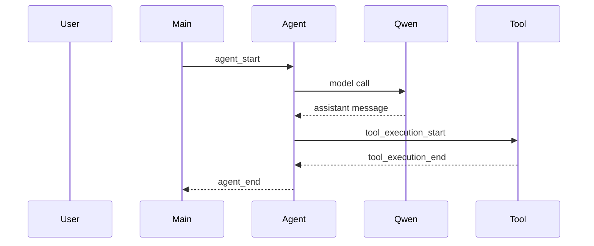

# P10 Trace Observability

P10 目标: 给 P9 minimal agent loop 增加可观察性, 把静态结构和运行过程变成可以查看、保存、复盘的材料。

## 目录

- [1. 背景](#1-背景)
- [2. 学习目标](#2-学习目标)
- [3. 最终产物](#3-最终产物)
- [4. 实施计划](#4-实施计划)
  - [4.1 P10A: 静态结构图](#41-p10a-静态结构图)
  - [4.2 P10B: AgentEvent JSONL trace](#42-p10b-agentevent-jsonl-trace)
  - [4.3 P10C: trace viewer](#43-p10c-trace-viewer)
- [5. Event 记录格式](#5-event-记录格式)
- [6. 文件结构](#6-文件结构)
- [7. 验收标准](#7-验收标准)
- [8. 和源码的对应关系](#8-和源码的对应关系)

## 1. 背景

P9 已经把 P8 的 mini agent loop 拆成了更接近 `packages/agent` 的结构:

```text
AgentState
AgentEvent
run_agent()
call_model_once()
extract_tool_calls()
execute_tools()
decide_next_step()
```

随着函数、类、模块变多, 只靠读代码很难快速理解:

```text
1. 文件之间怎么依赖
2. 函数之间怎么调用
3. 一次用户输入后 agent 内部发生了什么
4. tool call 在哪一轮发生
5. agent 为什么 stop / continue / error
```

P10 要解决这个问题。

## 2. 学习目标

P10 关注的是 agent 应用里的 observability。

核心问题:

```text
1. 静态结构如何表达?
2. 运行时事件如何记录?
3. trace 如何复盘一次 agent run?
4. event log 如何转成 sequence diagram?
5. 这些机制如何对应真实工程里的 UI / debugger / session recorder?
```

## 3. 最终产物

计划产出:

```text
study_area/02_agent/p10_trace_observability/
    README.md
    diagrams.md
    trace_writer.py
    trace_viewer.py
    traces/
        last_agent_events.jsonl
        last_agent_sequence.md
```

说明:

```text
diagrams.md
    手写 Mermaid 图, 描述 P9 的静态结构和主流程。

trace_writer.py
    把 P9 的 AgentEvent 写成 JSONL。

trace_viewer.py
    读取 JSONL trace, 生成 Mermaid sequence diagram。

traces/last_agent_events.jsonl
    最近一次 agent run 的事件记录。

traces/last_agent_sequence.md
    从事件记录生成的 Mermaid 时序图。
```

## 4. 实施计划

### 4.1 P10A: 静态结构图

创建:

```text
study_area/02_agent/p10_trace_observability/diagrams.md
```

包含三张 Mermaid 图:

```text
1. 文件依赖图
2. 核心函数调用图
3. AgentEvent 时序图
```

文件依赖图回答:

```text
p9_minimal_agent_loop.py 依赖哪些 P8 copy 模块?
qwen.py / tools.py / context.py / types.py 之间是什么关系?
```

核心函数调用图回答:

```text
main 如何进入 run_agent?
run_agent 如何调用 call_model_once / extract_tool_calls / execute_tools / decide_next_step?
```

AgentEvent 时序图回答:

```text
agent_start 到 agent_end 中间发生了什么?
turn_start / message_end / tool_execution_end 分别在什么时候出现?
```

### 4.2 P10B: AgentEvent JSONL trace

新增:

```text
study_area/02_agent/p10_trace_observability/trace_writer.py
```

目标:

```text
把 run_agent() yield 出来的 AgentEvent 保存到 JSONL 文件。
```

设计原则:

```text
1. 不影响终端交互输出。
2. 不保存 API key。
3. 不保存过大的完整 message content, 先保存 summary。
4. 每行一个 event, 方便 grep / tail / diff。
```

P9 main 后续可以这样接入:

```python
trace = TraceWriter("p10_trace_observability/traces/last_agent_events.jsonl")
for event in run_agent(api_key, state, char_delay=0.01):
    trace.write(event)
```

### 4.3 P10C: trace viewer

新增:

```text
study_area/02_agent/p10_trace_observability/trace_viewer.py
```

目标:

```text
读取 traces/last_agent_events.jsonl, 生成 traces/last_agent_sequence.md。
```

输出格式:

```md

```

## 5. Event 记录格式

P10 先记录高层 AgentEvent, 不记录底层 model stream event。

示例 JSONL:

```jsonl
{"type":"agent_start","timestamp":1710000000000}
{"type":"turn_start","timestamp":1710000000100}
{"type":"message_start","role":"assistant","timestamp":1710000000200}
{"type":"message_end","role":"assistant","stop_reason":"toolUse","timestamp":1710000000300}
{"type":"tool_execution_start","tool_call_id":"call_1","tool_name":"list_project_tree","timestamp":1710000000400}
{"type":"tool_execution_end","tool_call_id":"call_1","tool_name":"list_project_tree","is_error":false,"timestamp":1710000000500}
{"type":"turn_end","tool_result_count":1,"timestamp":1710000000600}
{"type":"agent_end","message_count":6,"timestamp":1710000000700}
```

事件压缩规则:

```text
message_start / message_end
    只记录 role、stop_reason、content block 数量。

tool_execution_start
    记录 tool_call_id、tool_name、args keys。

tool_execution_end
    记录 tool_call_id、tool_name、is_error。

agent_end
    记录 message_count, 不写完整上下文。
```

## 6. 文件结构

计划目录:

```text
study_area/02_agent/p10_trace_observability/
    README.md
    diagrams.md
    trace_writer.py
    trace_viewer.py
    traces/
        .gitkeep
        last_agent_events.jsonl
        last_agent_sequence.md
```

P9 仍然保留在:

```text
study_area/02_agent/p9_minimal_agent_loop.py
```

P10 不重写 P9, 只在必要时给 P9 增加 trace 接入点。

## 7. 验收标准

P10 完成时应满足:

```text
1. diagrams.md 中有三张 Mermaid 图。
2. 运行 P9 一次后生成 last_agent_events.jsonl。
3. JSONL 中能看到 agent_start -> agent_end。
4. 有 tool call 时能看到 tool_execution_start / tool_execution_end。
5. 运行 trace_viewer.py 后生成 last_agent_sequence.md。
6. Mermaid 时序图能表达一次 agent run 的主流程。
7. 终端交互仍然只显示 user / assistant。
```

## 8. 和源码的对应关系

P10 对应真实工程中的这些能力:

```text
packages/agent/src/agent-loop.ts
    AgentEvent stream
    message_start / message_update / message_end
    tool_execution_start / tool_execution_update / tool_execution_end
    turn_start / turn_end
    agent_start / agent_end
```

P10 是简化版:

```text
源码:
    EventStream + UI 实时订阅 + hooks + abort/error handling

P10:
    AgentEvent -> JSONL -> Mermaid sequence diagram
```

一句话:

```text
P10 把 P9 的 agent loop 从“能运行”推进到“能观察、能复盘、能画图”。
```
